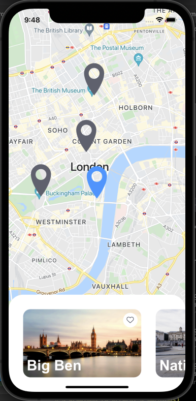
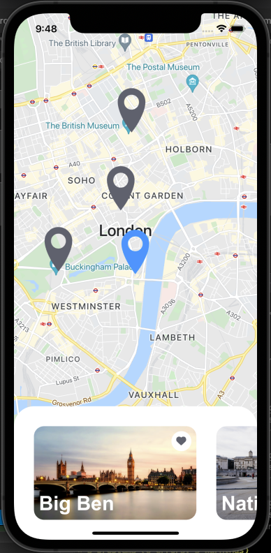
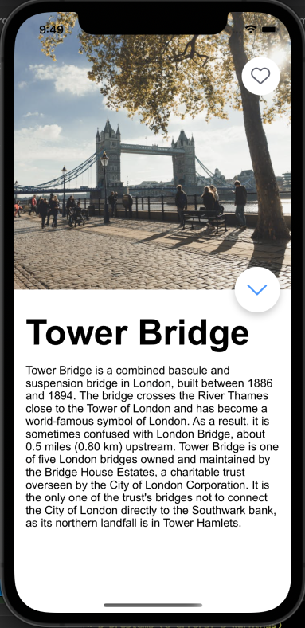

# Gary Hogarth Landmarks Proof of Concept App


[https://expo.dev/@garyhogarth/landmarks](https://expo.dev/@garyhogarth/landmarks)

Initial scaffolding based on React Native School TypeScript Expo Template - I use this to speed up development of Proof of Concepts.
Expo has been chosen for ease of deployment/sharing and as development was done over multiple small windows of time. Therefore not having to build to develop helps a lot.


## Usage

> Be sure to have the [Expo CLI](https://docs.expo.io/workflow/expo-cli/) installed.

Once checked out simply run:

```bash
yarn
expo start
```

## Other commands

- Run on iOS: `yarn ios` or `npm run ios`
- Run on Android: `yarn android` or `npm run android`
- Run on Web: `yarn web` or `npm run web`
- Compile TypeScript: `yarn tsc`
- Run Tests: `yarn test` or `npm run test`
- Lint Code: `yarn lint` or `npm run lint`
- Format Code: `yarn format` or `npm run format`

## Screenshots





## Known Issues

- Image is "snapping" at the end of its shared transition on Android, not present in IOS
